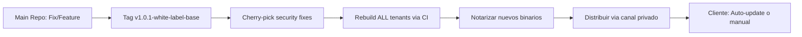

# MindLdger — Guía de Despliegue Multi-Cliente / White-Label

> **Versión:** 1.0.0  
> **Fecha:** 2026-07-13  
> **Autor:** Diego Medardo Saavedra García (Statick)  
> **Objetivo:** Procedimiento paso a paso para instanciar un nuevo "Tenant" (Clínica o Especialista) con aislamiento total de datos clínicos y branding personalizado sin tocar código Rust.

---

## 1. Visión General del Modelo White-Label

MindLdger **no es multi-tenant lógico** (una BD compartida con `tenant_id`). Cada cliente recibe:

| Recurso | Aislamiento |
|---------|-------------|
| **Base de datos** | `mind_ledger.db` independiente en `$APPDATA/mind-ledger-{tenant}/` |
| **Clave de cifrado** | 256-bit única generada por `OsRng` + almacenada en Keyring nativo |
| **Branding** | Tokens visuales via `app.config.json` (sin recompilar Rust) |
| **Configuración** | `settings` table por BD — nombre clínica, moneda, timezone, etc. |
| **Binario** | Mismo ejecutable firmado — solo cambia carpeta de datos y config |

```
Cliente A (Clínica San José)          Cliente B (Dr. Pérez - Consultorio)
┌─────────────────────────────┐       ┌─────────────────────────────┐
│ ~/Library/Application       │       │ ~/Library/Application       │
│ Support/mind-ledger-san-jose/│       │ Support/mind-ledger-perez/  │
│ ├── mind_ledger.db          │       │ ├── mind_ledger.db          │
│ ├── mind-ledger.key (0o600) │       │ ├── mind-ledger.key (0o600) │
│ └── app.config.json         │       │ └── app.config.json         │
└─────────────────────────────┘       └─────────────────────────────┘
         │                                    │
         └──────────────┬─────────────────────┘
                        ▼
              ┌───────────────────┐
              │ Mismo Binario     │
              │ MindLdger.app    │
              │ (firmado, notarizado)│
              └───────────────────┘
```

---

## 2. Prerrequisitos

| Herramienta | Versión | Uso |
|-------------|---------|-----|
| **Rust** | 1.80+ (via rustup) | Compilar binario release |
| **Node.js** | 20+ (via fnm/nvm) | Build frontend + Tauri CLI |
| **pnpm** | 9+ | Gestor de paquetes frontend |
| **Tauri CLI** | 2.x | `cargo tauri build` |
| **Xcode Command Line Tools** | Latest | Linker macOS |
| **Certificados Apple Developer** | Válidos | Firmar + Notarizar `.app` / `.dmg` |

```bash
# Verificar toolchain
rustc --version        # 1.80+
node --version         # 20+
pnpm --version         # 9+
cargo tauri --version  # 2.x
```

---

## 3. Paso 1 — Preparar Repositorio Base (Plantilla)

```bash
# 1. Clonar repo canónico (private)
git clone git@github.com:Statick88/MindLdger.git mindledger-template
cd mindledger-template

# 2. Verificar estado limpio (124 tests verdes)
cd src-tauri && cargo nextest run --workspace
cd .. && pnpm test && pnpm test:e2e

# 3. Tag de release base
git tag -a v1.0.0-white-label-base -m "White-label baseline"
git push origin v1.0.0-white-label-base
```

> **Nota:** Este tag es el **punto de partida inmutable** para todos los tenants. Cualquier fix de seguridad se backporta aquí y se re-taggea.

---

## 4. Paso 2 — Configuración de Marca (Branding Injection)

### 4.1 Crear `app.config.json` por Tenant

El archivo **no existe en el repo** — se genera por tenant en tiempo de build o se coloca junto al binario en runtime. Tauri lo lee vía `tauri.conf.json` > `bundle` > `externalBin` o se inyecta via `build.rs`.

**Ubicación recomendada (macOS):**
```
MindLdger.app/
├── Contents/
│   ├── MacOS/
│   │   └── MindLdger          ← Binario
│   ├── Resources/
│   │   ├── app.config.json     ← ← ← AQUÍ (readonly, firmado)
│   │   └── ...
│   └── Info.plist
```

**Estructura `app.config.json`:**
```json
{
  "$schema": "https://mindledger.app/schema/app-config.v1.json",
  "tenant": {
    "id": "clinica-san-jose-quito",
    "displayName": "Clínica San José",
    "shortName": "San José",
    "legalName": "Clínica San José S.A.",
    "taxId": "1791234567001",
    "country": "EC",
    "city": "Quito"
  },
  "branding": {
    "logo": {
      "light": "brand/logo-light.svg",
      "dark": "brand/logo-dark.svg",
      "favicon": "brand/favicon.ico"
    },
    "colors": {
      "primary": "#0F4C5C",
      "primaryForeground": "#FFFFFF",
      "secondary": "#E5F1EE",
      "secondaryForeground": "#212529",
      "accent": "#E3645F",
      "accentForeground": "#FFFFFF",
      "background": "#F8F9FA",
      "foreground": "#212529",
      "border": "#D6DCE4",
      "ring": "#0F4C5C"
    },
    "typography": {
      "fontFamily": "Inter, system-ui, sans-serif",
      "fontSizeBase": "14px",
      "lineHeightBase": "1.5"
    },
    "borderRadius": "0.5rem"
  },
  "ui": {
    "appTitle": "Clínica San José — Gestión Clínica",
    "windowTitle": "Clínica San José",
    "menuBar": {
      "appMenu": "Clínica San José",
      "helpMenu": "Ayuda San José"
    },
    "loginScreen": {
      "welcomeTitle": "Bienvenido a Clínica San José",
      "welcomeSubtitle": "Gestión clínica y contable segura",
      "backgroundImage": "brand/login-bg.jpg"
    }
  },
  "defaults": {
    "currency": "USD",
    "timezone": "America/Guayaquil",
    "language": "es-EC",
    "appointmentDuration": 30,
    "ageOfMajority": 18
  },
  "features": {
    "accounting": true,
    "diagnostics": true,
    "appointments": true,
    "clinicalNotes": true,
    "reports": true,
    "multiUser": false
  },
  "compliance": {
    "dataRetentionYears": 7,
    "encryptionStandard": "AES-256-SQLCipher",
    "auditLogEnabled": true,
    "gdprMode": false,
    "lopdEcuador": true
  }
}
```

### 4.2 Inyección en Build (build.rs)

```rust
// src-tauri/app/build.rs
use std::env;
use std::fs;
use std::path::PathBuf;

fn main() {
    // Permite override via env var: TENANT_CONFIG=../tenant-configs/clinica-san-jose.json
    let tenant_config = env::var("TENANT_CONFIG").unwrap_or_else(|_| {
        "tenant-configs/default.json".to_string()
    });
    
    let config_path = PathBuf::from(&tenant_config);
    if config_path.exists() {
        let dest = PathBuf::from(env::var("OUT_DIR").unwrap()).join("app.config.json");
        fs::copy(&config_path, &dest).expect("Failed to copy tenant config");
        println!("cargo:rustc-env=TENANT_CONFIG_PATH={}", dest.display());
    }
    
    tauri_build::build()
}
```

### 4.3 Lectura en Runtime (Rust)

```rust
// src-tauri/commands/src/settings_commands.rs
#[command]
pub fn get_tenant_config() -> Result<TenantConfig, String> {
    let config_path = std::env::var("TENANT_CONFIG_PATH")
        .map_err(|_| "Tenant config not embedded".to_string())?;
    let content = std::fs::read_to_string(config_path)
        .map_err(|e| format!("Read config: {}", e))?;
    serde_json::from_str(&content).map_err(|e| format!("Parse config: {}", e))
}
```

### 4.4 Consumo en Frontend (React)

```typescript
// src/hooks/useTenantConfig.ts
import { useQuery } from '@tanstack/react-query';
import { invoke } from '@tauri-apps/api/core';

export interface TenantConfig {
  tenant: TenantInfo;
  branding: BrandingTokens;
  ui: UiStrings;
  defaults: DefaultSettings;
  features: FeatureFlags;
  compliance: ComplianceConfig;
}

export function useTenantConfig() {
  return useQuery<TenantConfig>({
    queryKey: ['tenantConfig'],
    queryFn: () => invoke('get_tenant_config'),
    staleTime: Infinity, // Nunca cambia en runtime
  });
}

// Uso en componentes
function Header() {
  const { data: config } = useTenantConfig();
  const logo = config?.branding.logo.light;
  const appTitle = config?.ui.appTitle ?? 'MindLdger';
  const primary = config?.branding.colors.primary;
  
  return (
    <header style={{ borderColor: primary }}>
      
      <h1>{appTitle}</h1>
    </header>
  );
}
```

### 4.5 Tokens CSS Dinámicos (Tailwind + CSS Variables)

```css
/* src/index.css — Se inyecta via :root en mount */
@layer base {
  :root {
    /* Valores por defecto (MindLdger base) */
    --brand-primary: 192 72% 21%;        /* #0F4C5C */
    --brand-secondary: 165 30% 92%;      /* #E5F1EE */
    --brand-accent: 2 72% 63%;           /* #E3645F */
    --brand-background: 210 20% 98%;     /* #F8F9FA */
    --brand-foreground: 213 11% 15%;     /* #212529 */
    --brand-border: 214 20% 90%;         /* #D6DCE4 */
    --brand-ring: 192 72% 21%;
    --brand-radius: 0.5rem;
  }
}

/* App.tsx — Aplicar config de tenant al montar */
useEffect(() => {
  if (config?.branding.colors) {
    const root = document.documentElement;
    root.style.setProperty('--brand-primary', hexToHsl(config.branding.colors.primary));
    root.style.setProperty('--brand-secondary', hexToHsl(config.branding.colors.secondary));
    root.style.setProperty('--brand-accent', hexToHsl(config.branding.colors.accent));
    root.style.setProperty('--brand-background', hexToHsl(config.branding.colors.background));
    root.style.setProperty('--brand-foreground', hexToHsl(config.branding.colors.foreground));
    root.style.setProperty('--brand-border', hexToHsl(config.branding.colors.border));
    root.style.setProperty('--brand-radius', config.branding.borderRadius);
  }
}, [config]);
```

> **Resultado:** Cambio de colores, logos, textos de menú, pantallas de login — **sin recompilar Rust**, solo nuevo `app.config.json` + assets de marca en `Resources/`.

---

## 5. Paso 3 — Inicialización Criptográfica Aislada (Por Tenant)

### 5.1 Principio: Una BD = Una Clave = Un Keyring Entry

```rust
// infrastructure/src/keyring.rs — Ya implementado
pub struct SqlCipherKeyManager {
    entry: Option<Entry>,           // Keychain/Credential Manager/Secret Service
    fallback_path: Option<PathBuf>, // $APPDATA/mind-ledger-{tenant}/mind-ledger.key
}

impl SqlCipherKeyManager {
    pub fn new_with_fallback(
        service_name: &str,           // "mind-ledger"
        account_name: &str,           // "sqlcipher-key-{tenant_id}"
        data_dir: &Path,              // $APPDATA/mind-ledger-{tenant}/
    ) -> Self { ... }
}
```

### 5.2 Generación de Carpeta de Datos por Tenant

```rust
// app/src/main.rs — Modificación mínima para multi-tenant
fn get_tenant_data_dir(tenant_id: &str) -> Result<PathBuf> {
    let base = dirs::data_dir()
        .ok_or_else(|| anyhow!("No data dir"))?
        .join(format!("mind-ledger-{}", tenant_id));
    fs::create_dir_all(&base)?;
    Ok(base)
}

// En setup():
let tenant_id = std::env::var("TENANT_ID").unwrap_or_else(|_| "default".into());
let data_dir = get_tenant_data_dir(&tenant_id)?;
let db_path = data_dir.join("mind_ledger.db");

let key_manager = SqlCipherKeyManager::new_with_fallback(
    "mind-ledger",
    &format!("sqlcipher-key-{}", tenant_id),  // ← Keyring entry único por tenant
    &data_dir,
);
let key = key_manager.get_or_create_key()?;
let pool = create_pool_with_key(&db_path, &key)?;
app_handle.manage(Arc::new(pool));
```

### 5.3 Flujo de Primera Ejecución (First Run)

```mermaid
flowchart TD
    A[Usuario lanza MindLdger.app] --> B{Existe TENANT_ID?}
    B -->|No| C[Leer app.config.json → tenant.id]
    C --> D[Crear $APPDATA/mind-ledger-{tenant.id}/]
    D --> E[SqlCipherKeyManager::new_with_fallback]
    E --> F{Keyring disponible?}
    F -->|Sí| G[Entry.get_password()]
    G --> H{Existe clave?}
    H -->|No| I[Generar 32 bytes OsRng]
    I --> J[Entry.set_password(clave_hex)]
    J --> K[PRAGMA key = 'clave_hex'; CREATE TABLE...]
    F -->|No| L[Leer/Crear fallback file mind-ledger.key 0o600]
    L --> K
    K --> M[run_migrations pool]
    M --> N[App lista]
```

### 5.4 Verificación de Aislamiento (Checklist)

| Verificación | Cómo Probar |
|--------------|-------------|
| **BD distinta por tenant** | `ls ~/Library/Application\ Support/mind-ledger-*/mind_ledger.db` → archivos distintos |
| **Claves distintas** | `sqlite3 mind_ledger.db \"PRAGMA key='wrong'; SELECT 1;\"` → error `file is not a database` |
| **Keyring entries separados** | macOS: `security find-generic-password -s mind-ledger -a sqlcipher-key-<tenant>` |
| **Permisos fallback** | `stat -f \"%A\" mind-ledger.key` → `600` (owner read/write only) |
| **Cero cruce de datos** | Insertar paciente en Tenant A → consultar Tenant B → 0 resultados |

---

## 6. Paso 4 — Build & Distribución por Tenant

### 6.1 Script de Build Automatizado

```bash
#!/bin/bash
# scripts/build-tenant.sh
# Uso: ./build-tenant.sh clinica-san-jose-quito

set -euo pipefail

TENANT_ID="${1:?Usage: $0 <tenant-id>}"
CONFIG_DIR="tenant-configs"
OUT_DIR="dist/${TENANT_ID}"

echo "🏗️  Building tenant: ${TENANT_ID}"

# 1. Validar config existe
CONFIG_FILE="${CONFIG_DIR}/${TENANT_ID}.json"
[[ -f "${CONFIG_FILE}" ]] || { echo "❌ Config not found: ${CONFIG_FILE}"; exit 1; }

# 2. Preparar assets de marca
BRAND_DIR="tenant-assets/${TENANT_ID}"
mkdir -p "${OUT_DIR}/brand"
cp -r "${BRAND_DIR}/." "${OUT_DIR}/brand/" 2>/dev/null || true

# 3. Build frontend con config inyectada
cd ../mindledger-template  # repo base
TENANT_CONFIG="${CONFIG_FILE}" TENANT_ID="${TENANT_ID}" pnpm build

# 4. Build Tauri (Rust) con config embebida
cd src-tauri/app
TENANT_CONFIG="../../${CONFIG_FILE}" TENANT_ID="${TENANT_ID}" cargo tauri build \
  --target universal-apple-darwin \
  --config "../../../tauri.conf.json"

# 5. Copiar artifacts
mkdir -p "../../${OUT_DIR}"
cp -r target/universal-apple-darwin/release/bundle/macos/MindLdger.app "../../${OUT_DIR}/"
cp -r target/universal-apple-darwin/release/bundle/dmg/*.dmg "../../${OUT_DIR}/" 2>/dev/null || true

# 6. Firmar y notarizar (requiere certs Apple Developer)
# codesign --deep --force --verify --verbose --sign "Developer ID Application: ..." \
#   --options runtime "../../${OUT_DIR}/MindLdger.app"
# xcrun notarytool submit "../../${OUT_DIR}/MindLdger.dmg" \
#   --apple-id "..." --team-id "..." --password "@keychain:notary" --wait
# xcrun stapler staple "../../${OUT_DIR}/MindLdger.app"

echo "✅ Build completo en: ${OUT_DIR}"
echo "   App: ${OUT_DIR}/MindLdger.app"
echo "   DMG: ${OUT_DIR}/MindLdger-${TENANT_ID}.dmg"
```

### 6.2 Estructura de Carpeta de Tenant

```
tenant-configs/
├── clinica-san-jose-quito.json
├── dr-perez-guayaquil.json
├── hospital-norte-cuenca.json
└── default.json                    # Fallback

tenant-assets/
├── clinica-san-jose-quito/
│   ├── logo-light.svg
│   ├── logo-dark.svg
│   ├── favicon.ico
│   └── login-bg.jpg
├── dr-perez-guayaquil/
│   └── ...
```

### 6.3 tauri.conf.json — Variables por Tenant

```json
{
  "productName": "{{TENANT_DISPLAY_NAME}}",
  "identifier": "com.mindledger.{{TENANT_ID}}",
  "bundle": {
    "shortDescription": "{{TENANT_SHORT_DESC}}",
    "longDescription": "{{TENANT_LONG_DESC}}",
    "copyright": "Copyright © 2026 {{TENANT_LEGAL_NAME}}",
    "category": "Medical"
  },
  "build": {
    "frontendDist": "../app/dist"
  }
}
```

> **Templating:** Usar `sed` o `handlebars` en `build-tenant.sh` para reemplazar `{{PLACEHOLDERS}}` desde `app.config.json`.

---

## 7. Paso 5 — Configuración Inicial por Cliente (Onboarding)

### 7.1 Primera Ejecución — Wizard de Setup

Al lanzar por primera vez, la app detecta BD vacía y muestra:

```typescript
// src/pages/OnboardingWizard.tsx
const steps = [
  { id: 'welcome', title: 'Bienvenido', component: WelcomeStep },
  { id: 'clinic', title: 'Datos de la Clínica', component: ClinicDataStep },
  { id: 'accounting', title: 'Plan Contable', component: AccountingSetupStep },
  { id: 'diagnostics', title: 'Catálogos CIE-10/DSM-5', component: DiagnosticsStep },
  { id: 'users', title: 'Usuarios Iniciales', component: UsersStep },
  { id: 'complete', title: '¡Listo!', component: CompleteStep },
];

// ClinicDataStep — Persiste en settings table
const saveClinicData = async (data: ClinicData) => {
  await settingsApi.update({
    clinic_name: data.name,
    clinic_address: data.address,
    clinic_phone: data.phone,
    clinic_email: data.email,
    timezone: data.timezone,
    currency: data.currency,
    language: data.language,
  });
};
```

### 7.2 Plan Contable Base (Ecuador)

```sql
-- Se ejecuta en AccountingSetupStep via invoke('seed_chart_of_accounts')
INSERT INTO chart_of_accounts (code, name, type, parent_code) VALUES
-- ACTIVOS (1xxx)
('1', 'ACTIVO', 'asset', NULL),
('11', 'ACTIVO CORRIENTE', 'asset', '1'),
('1110', 'CAJA', 'asset', '11'),
('1120', 'BANCOS', 'asset', '11'),
('1130', 'CUENTAS POR COBRAR', 'asset', '11'),
('12', 'ACTIVO NO CORRIENTE', 'asset', '1'),
('1210', 'MOBILIARIO Y EQUIPO', 'asset', '12'),
('1220', 'EQUIPO MÉDICO', 'asset', '12'),

-- PASIVOS (2xxx)
('2', 'PASIVO', 'liability', NULL),
('21', 'PASIVO CORRIENTE', 'liability', '2'),
('2110', 'PROVEEDORES', 'liability', '21'),
('2120', 'IMPUESTOS POR PAGAR', 'liability', '21'),

-- PATRIMONIO (3xxx)
('3', 'PATRIMONIO', 'equity', NULL),
('3110', 'CAPITAL SOCIAL', 'equity', '3'),
('3120', 'RESULTADOS ACUMULADOS', 'equity', '3'),

-- INGRESOS (4xxx)
('4', 'INGRESOS', 'revenue', NULL),
('4110', 'HONORARIOS MÉDICOS', 'revenue', '4'),
('4120', 'CONSULTAS EXTERNAS', 'revenue', '4'),
('4130', 'PROCEDIMIENTOS', 'revenue', '4'),

-- GASTOS (5xxx)
('5', 'GASTOS', 'expense', NULL),
('5110', 'ALQUILER', 'expense', '5'),
('5120', 'SERVICIOS BÁSICOS', 'expense', '5'),
('5130', 'INSUMOS MÉDICOS', 'expense', '5'),
('5140', 'PUBLICIDAD', 'expense', '5'),

-- COSTOS (6xxx)
('6', 'COSTOS DE VENTA', 'expense', NULL),
('6110', 'COSTO SERVICIOS MÉDICOS', 'expense', '6');
```

### 7.3 Catálogos CIE-10 / DSM-5 (Pre-cargados)

```bash
# Script de carga masiva (una vez por tenant)
cd src-tauri
cargo run --bin seed_diagnostics -- --tenant-id clinica-san-jose-quito
```

---

## 8. Paso 6 — Checklist de Entrega al Cliente

| Ítem | Verificación | Responsable |
|------|--------------|-------------|
| ✅ **Binario firmado + notarizado** | `codesign -dv MindLdger.app` + `spctl -a -v MindLdger.app` | DevOps |
| ✅ **DMG instalable** | Montar DMG → arrastrar a Applications → lanzar sin Gatekeeper | QA |
| ✅ **Aislamiento BD verificado** | 2 instancias paralelas → datos no se cruzan | QA |
| ✅ **Branding correcto** | Logo, colores, textos menú, login screen match `app.config.json` | Diseño |
| ✅ **Config por defecto** | Moneda USD, zona Guayaquil, español EC, plan contable EC | Contabilidad |
| ✅ **CIE-10/DSM-5 cargados** | Buscar 'F32' → Depresión mayor → aparece | Clínico |
| ✅ **Backup/Restore probado** | Exportar BD → reinstalar app → importar → datos íntegros | DevOps |
| ✅ **Documentación usuario** | PDF manual usuario + video onboarding 5 min | Docs |
| ✅ **Contrato/SLA firmado** | Términos de licencia, soporte, actualizaciones | Legal |

---

## 9. Mantenimiento y Actualizaciones

### 9.1 Pipeline de Updates



### 9.2 Actualización In-Place (Auto-Update)

```rust
// Tauri Updater config (tauri.conf.json)
"updater": {
  "active": true,
  "endpoints": ["https://updates.mindledger.app/{{TENANT_ID}}/latest.json"],
  "dialog": true,
  "pubkey": "dW50cnVzdGVkIGNvbW1lbnQ6IG1pbmQtbGVkZ2VyIHB1YmxpYyBrZXk..."
}
```

> Cada tenant tiene su **canal de updates aislado** — permite rollout escalonado (canary → stable).

### 9.3 Migración de Esquema (Zero-Downtime)

```rust
// infrastructure/src/migrations.rs — Versionado por PRAGMA user_version
pub fn run_migrations(pool: &DbPool) -> Result<()> {
    let conn = pool.lock()?;
    let current_version: i32 = conn.query_row(
        "PRAGMA user_version", [], |r| r.get(0)
    )?;
    
    if current_version < 2 {
        conn.execute_batch(include_str!("../migrations_v2.sql"))?;
        conn.execute_batch("PRAGMA user_version = 2;")?;
    }
    // ...
}
```

---

## 10. Troubleshooting Común

| Problema | Causa | Solución |
|----------|-------|----------|
| `PRAGMA key` falla: `file is not a database` | Clave errónea o BD corrupta | Verificar keyring entry correcto; borrar BD y dejar regenerar |
| `Mutex poisoned` en logs | Panic en thread previo | `panic = "abort"` en release profile ya mitiga; reiniciar app |
| Branding no aplica | `app.config.json` no embebido o mal path | Verificar `TENANT_CONFIG_PATH` en build.rs; logs de `get_tenant_config` |
| Keyring `Entry::new` falla en Linux | `libsecret` no instalado | `sudo apt install libsecret-1-dev` / `dnf install libsecret-devel` |
| WAL mode error | SQLCipher compilado sin WAL | Fallback a DELETE ya implementado en `database.rs:43-47` |
| Updater: `signature verification failed` | Clave pública distinta | Verificar `updater.pubkey` coincide con clave de firma |

---

## 11. Referencia Rápida de Comandos

```bash
# Crear nuevo tenant (interactivo)
./scripts/new-tenant.sh
# → Pregunta: tenant-id, display-name, legal-name, city, currency
# → Genera: tenant-configs/<id>.json + tenant-assets/<id>/

# Build single tenant
./scripts/build-tenant.sh clinica-san-jose-quito

# Build ALL tenants (CI)
./scripts/build-all-tenants.sh

# Test aislamiento local
TENANT_ID=test-a cargo run  # Terminal 1
TENANT_ID=test-b cargo run  # Terminal 2
# Verificar: datos no se cruzan

# Inspeccionar keyring (macOS)
security find-generic-password -s mind-ledger -a sqlcipher-key-clinica-san-jose-quito -w

# Ver permisos fallback key
ls -la ~/Library/Application\ Support/mind-ledger-*/mind-ledger.key
# Debe mostrar: -rw------- (600)
```

---

## 12. Glosario White-Label

| Término | Definición |
|---------|------------|
| **Tenant** | Instancia aislada de MindLdger para un cliente (clínica/especialista) |
| **Branding Injection** | Inyección de tokens visuales (colores, logos, textos) via `app.config.json` sin recompilar Rust |
| **Keyring Entry** | Credencial en almacenamiento seguro del OS (Keychain/Credential Manager/Secret Service) |
| **Fallback Key File** | Archivo `mind-ledger.key` (0o600) usado si keyring no disponible |
| **TENANT_ID** | Identificador único slug (ej: `clinica-san-jose-quito`) — usado en paths, keyring, updates |
| **Channel de Updates** | Endpoint JSON por tenant para auto-update (`/{{TENANT_ID}}/latest.json`) |
| **Plan Contable Base** | Cuentas pre-cargadas (1xxx-6xxx) adaptadas a normativa ecuatoriana |

---

> **Fin de la Guía White-Label**  
> Este documento es **parte del entregable de replicabilidad senior** — versionar junto al código.  
> Próxima revisión: tras primer deployment multi-cliente real (feedback de onboarding).